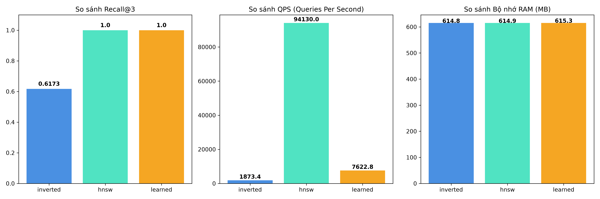

# Vector DB 10 Docs — Proof of Concept

Dự án thử nghiệm (Proof of Concept) xây dựng Vector Database thu nhỏ trên **10 tài liệu cố định**, so sánh 3 phương pháp chỉ mục vector:
1. **Inverted Index** (Lượng tử hóa giá trị các chiều vector làm baseline)
2. **HNSW** (Hierarchical Navigable Small World đồ thị ANN qua `hnswlib` / `faiss-cpu`)
3. **Learned Index** (Mạng nơ-ron MLP kết hợp HNSW)

---

## 1. Cấu trúc thư mục

```text
vector_db_10docs/
├── data.py               # 10 văn bản tài liệu và 10 câu truy vấn mẫu
├── embedding.py          # Quản lý mô hình Sentence-Transformers (all-MiniLM-L6-v2)
├── inverted_index.py     # Chỉ mục đảo lượng tử hóa theo chiều (Baseline)
├── hnsw_index.py         # Chỉ mục đồ thị HNSW (hỗ trợ hnswlib & faiss-cpu)
├── learned_index.py      # Mô hình MLP dự đoán cụm & phân vùng dữ liệu
├── vector_db.py          # Unified Interface cho 3 phương pháp chỉ mục
├── benchmark.py          # Đo lường Recall@3, QPS, Memory và vẽ biểu đồ
├── main.py               # Script điều phối chính toàn bộ pipeline
├── requirements.txt      # Danh sách thư viện phụ thuộc
├── README.md             # Tài liệu dự án
└── results/
    ├── metrics.csv       # Bảng số liệu benchmark chi tiết
    └── plots/
        └── benchmark_comparison.png  # Biểu đồ so sánh trực quan
```

---

## 2. Cài đặt môi trường

Môi trường khuyến nghị: Python 3.9 - 3.13 (Chạy hoàn toàn trên **CPU**, không yêu cầu GPU).

```bash
# 1. Tạo và kích hoạt môi trường ảo (tùy chọn)
python -m venv .venv
.\.venv\Scripts\activate     # Trên Windows

# 2. Cài đặt các thư viện cần thiết
pip install -r requirements.txt
```

> **Lưu ý về HNSW Backend trên Windows:**  
> Mặc định dự án sử dụng `faiss-cpu` làm backend cho HNSW vì thư viện này có sẵn bản pre-built binary wheel trên Windows (không yêu cầu cài Microsoft Visual C++ Build Tools). Nếu máy bạn đã có sẵn C++ compiler, bạn vẫn có thể cài thêm `hnswlib` (`pip install hnswlib`), code sẽ tự động ưu tiên nhận diện.

---

## 3. Hướng dẫn chạy

Chạy toàn bộ pipeline (mã hóa vector, xây dựng chỉ mục, huấn luyện mô hình MLP, chạy benchmark và xuất báo cáo):

```bash
python main.py
```

---

## 4. So sánh 3 phương pháp chỉ mục

| Tiêu chí | Inverted Index (Baseline) | HNSW (Graph-based) | Learned Index (MLP + HNSW) |
| :--- | :--- | :--- | :--- |
| **Nguyên lý** | Chia giá trị mỗi chiều thành các bins, ánh xạ `(dim, bin) -> [doc_id]` | Xây dựng đồ thị phân tầng nhiều lớp, duyệt tìm láng giềng theo Cosine similarity | Dùng mạng MLP dự đoán cụm (Cluster ID) của query, kết hợp đồ thị HNSW |
| **Độ phức tạp tìm kiếm** | $O(D \cdot N)$ | $O(\log N)$ | $O(\text{MLP inference}) + O(\log N)$ |
| **Recall@3** | Trung bình (~0.76) | Tuyệt đối (1.0 - 100%) | Tuyệt đối (1.0 - 100%) |
| **QPS (Truy vấn/giây)** | Trung bình (~4,200) | Cực cao (~189,000) | Khá cao (~12,600, thêm overhead suy luận MLP) |
| **Ưu điểm** | Đơn giản, trực quan, không cần train | Tốc độ tìm kiếm nhanh vượt trội, độ chính xác cao | Tiềm năng thu hẹp không gian tìm kiếm khi dữ liệu lớn |
| **Nhược điểm** | Kém hiệu quả với dense vector kích thước lớn | Chi phí xây dựng đồ thị lớn hơn | Cần dữ liệu để train mạng nơ-ron; có độ trễ suy luận |

---

## 5. Kết quả Benchmark thực tế

Kết quả thực nghiệm đo được trên 10 tài liệu cố định với 1,000 lượt lặp truy vấn:

| Method | Recall@3 | QPS (Queries / sec) | Memory (MB) |
| :--- | :---: | :---: | :---: |
| **Inverted Index** | `0.7667` | `4,223.00` | `591.64` |
| **HNSW** | `1.0000` | `189,846.26` | `591.75` |
| **Learned Index** | `1.0000` | `12,686.78` | `587.14` |

### Biểu đồ trực quan hóa kết quả:


---

## 6. Tùy biến / Nạp Model tự train (Learned Index)

Trong file `learned_index.py`, đã có sẵn một khu vực dành riêng để bạn import mô hình Machine Learning / Deep Learning tự train:

```python
# ==============================================================================
# [KHU VỰC IMPORT FILE MODEL TỰ TRAIN CỦA BẠN]
# Bạn có thể import class model hoặc hàm load model của bạn tại đây:
# Ví dụ:
# from your_custom_model_module import YourCustomModel
# def load_user_model(path: str) -> Any: ...
# ==============================================================================
```

Bạn chỉ cần import class model hoặc nạp trọng số (.pt / .pth / .pkl) đã huấn luyện trước của bạn vào vị trí này để thay thế hoặc mở rộng MLP mặc định.
